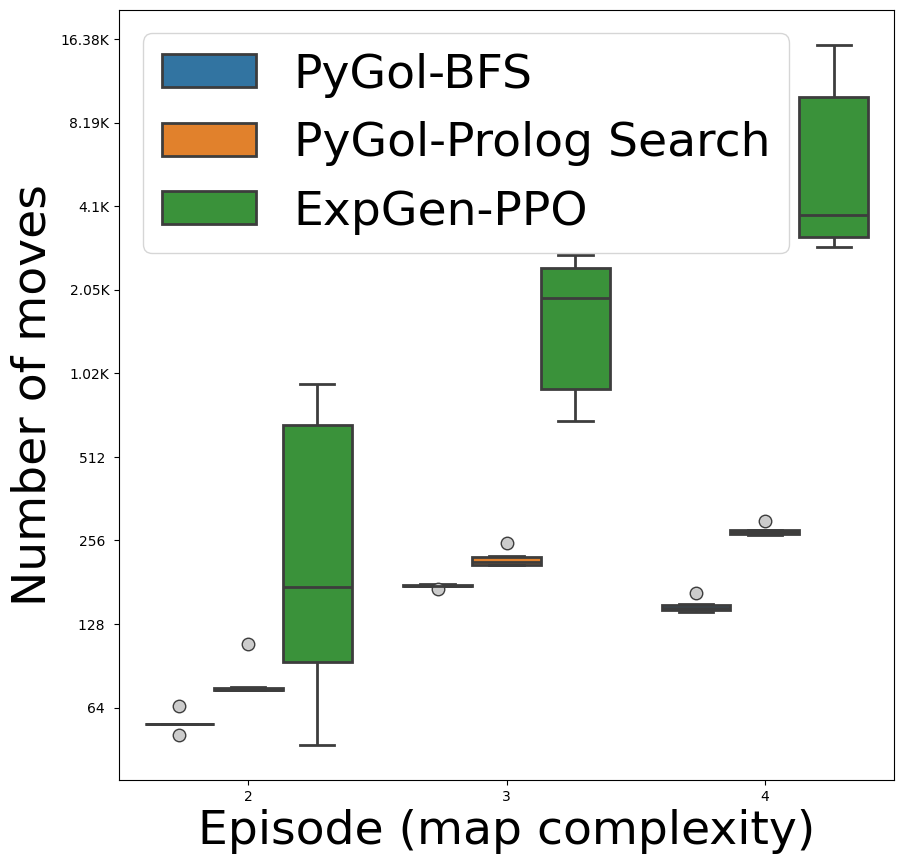
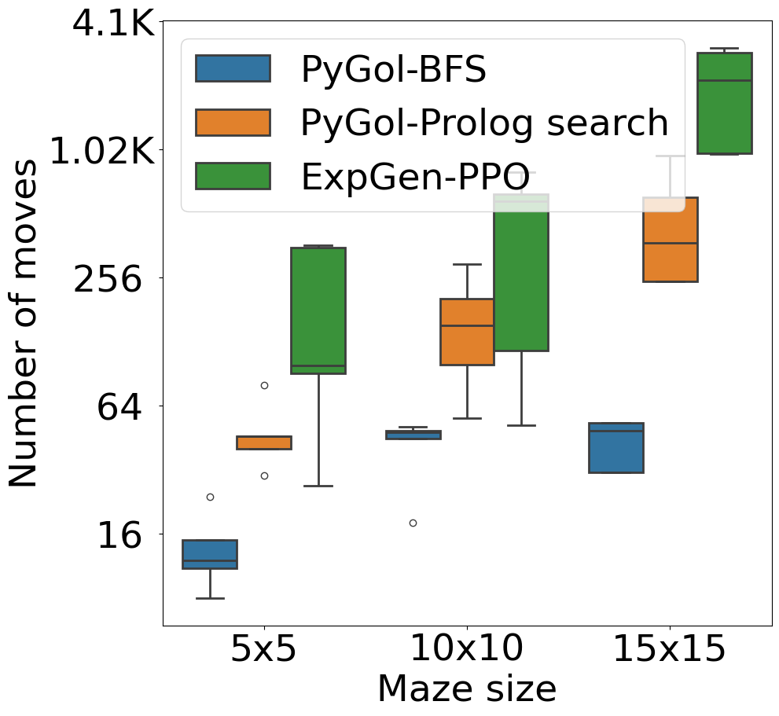

# One-Shot Learning of Autonomous Behavior: A Meta-interpretive Learning approach
This repository contains supplamantry and experimental material for the IJCLR 2024 paper.

### Requirements
<ul>
  <li>SWI Prolog version 9 and above <a href="https://www.swi-prolog.org">swi-prolog.org</a></li>
  <li>Python 3 and above <a href="https://www.python.org/downloads/">Download</a></li>
  <li>PyGol <a href=https://github.com/PyGol/PyGol-versions">Github</a> </li>
  <li>Download ExpGen <a href="https://github.com/EvZissel/expgen">Github</a></li>
</ul>  

### Usage for MIE (Meta-Interpretive Learning)

To run experiments related to Meta-Interpretive Learning (MIE):

1. **Install PyGol**  
   Clone or install PyGol from the official GitHub repository:  
   [https://github.com/danyvarghese/PyGol](https://github.com/danyvarghese/PyGol)

2. **Set Up MIE Directory**  
   Download the `MIE` folder from this repository and place it inside your project directory.

3. **Run Experiments**  
   Follow the usage instructions provided in the PyGol documentation to execute MIE-related experiments:  
   [https://github.com/danyvarghese/PyGol#usage](https://github.com/danyvarghese/PyGol#usage)

### Usage for MIL
<ol>
  <li>Install PyGol from its Github link</li>
  <li>Download MIL folder from this repository into your project folder</li>
  <li>Follow the instruction on PyGol Github</li>
</ol>  

### Usage for RL
<ol>
  <li>Download RL folder from this repository into your project folder</li>
  <li>To train the PPO model for the lake task run train.py</li>
  <li>Easily run test.py</li>
</ol>  

### note:

The file undistortion.py is used to generate normalaised maze matrix for logic purposes

